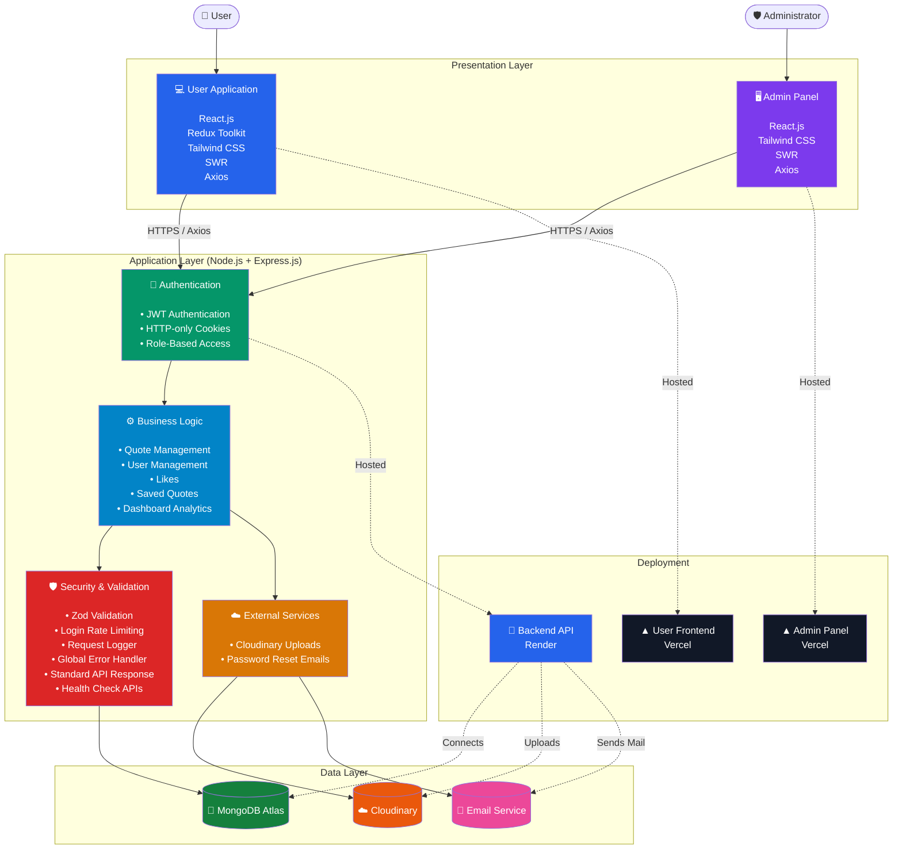

```mermaid
flowchart TB

%%==========================
%% Users
%%==========================

USER([👤 User])
ADMIN([🛡️ Administrator])

%%==========================
%% Presentation Layer
%%==========================

subgraph PRESENTATION["Presentation Layer"]

USERAPP["💻 User Application

React.js
Redux Toolkit
Tailwind CSS
SWR
Axios"]

ADMINAPP["🖥️ Admin Panel

React.js
Tailwind CSS
SWR
Axios"]

end

%%==========================
%% Backend
%%==========================

subgraph BACKEND["Application Layer (Node.js + Express.js)"]

AUTH["🔐 Authentication

• JWT Authentication
• HTTP-only Cookies
• Role-Based Access"]

BUSINESS["⚙️ Business Logic

• Quote Management
• User Management
• Likes
• Saved Quotes
• Dashboard Analytics"]

SECURITY["🛡️ Security & Validation

• Zod Validation
• Login Rate Limiting
• Request Logger
• Global Error Handler
• Standard API Response
• Health Check APIs"]

SERVICES["☁️ External Services

• Cloudinary Uploads
• Password Reset Emails"]

end

%%==========================
%% Database
%%==========================

subgraph DATA["Data Layer"]

DATABASE[(🍃 MongoDB Atlas)]

MEDIA[(☁️ Cloudinary)]

EMAIL[(📧 Email Service)]

end

%%==========================
%% Deployment
%%==========================

subgraph DEPLOYMENT["Deployment"]

VERCEL1["▲ User Frontend
Vercel"]

VERCEL2["▲ Admin Panel
Vercel"]

RENDER["🚀 Backend API
Render"]

end

%%==========================
%% Connections
%%==========================

USER --> USERAPP
ADMIN --> ADMINAPP

USERAPP -->|HTTPS / Axios| AUTH
ADMINAPP -->|HTTPS / Axios| AUTH

AUTH --> BUSINESS

BUSINESS --> SECURITY

SECURITY --> DATABASE

BUSINESS --> SERVICES

SERVICES --> MEDIA

SERVICES --> EMAIL

USERAPP -. Hosted .-> VERCEL1
ADMINAPP -. Hosted .-> VERCEL2
AUTH -. Hosted .-> RENDER

RENDER -. Connects .-> DATABASE
RENDER -. Uploads .-> MEDIA
RENDER -. Sends Mail .-> EMAIL

%%==========================
%% Colors
%%==========================

style USERAPP fill:#2563eb,color:#fff
style ADMINAPP fill:#7c3aed,color:#fff

style AUTH fill:#059669,color:#fff
style BUSINESS fill:#0284c7,color:#fff
style SECURITY fill:#dc2626,color:#fff
style SERVICES fill:#d97706,color:#fff

style DATABASE fill:#15803d,color:#fff
style MEDIA fill:#ea580c,color:#fff
style EMAIL fill:#ec4899,color:#fff

style VERCEL1 fill:#111827,color:#fff
style VERCEL2 fill:#111827,color:#fff
style RENDER fill:#2563eb,color:#fff
```

