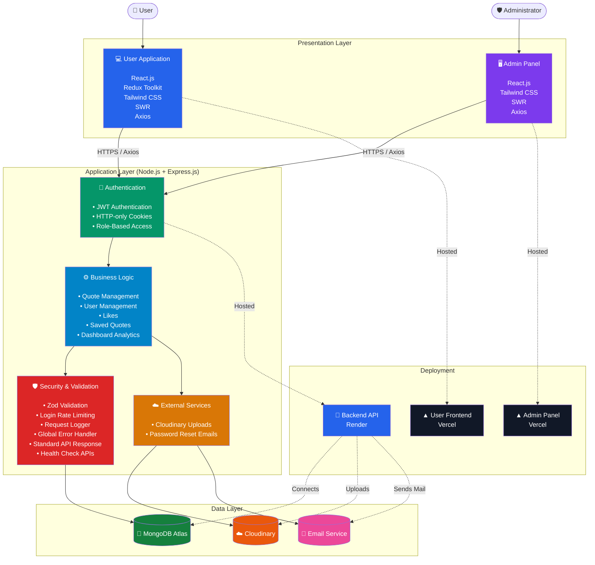

# 🚀 Installation & Setup

## Prerequisites

Before running the project, make sure you have the following installed:

- Node.js (v18 or later)
- pnpm
- Git
- MongoDB Atlas account
- Cloudinary account
- Gmail App Password and Email

---

## 1️⃣ Clone the Repository

```bash
git clone https://github.com/AmitKaliyani/06_quote_backend.git

```

---

## 2️⃣ Install Dependencies

```bash
pnpm install
```

---

## 3️⃣ Configure Environment Variables

Create a `.env` file in the project root and add the required environment variables.

```env
# ==========================================
# Application
# ==========================================

NODE_ENV=development
PORT=8000

# ==========================================
# Database
# ==========================================

MONGODB_URI=your_mongodb_connection_string

# ==========================================
# JWT
# ==========================================

JWT_SECRET=
ADMIN_JWT_SECRET=
JWT_REFRESH_SECRET=

# ==========================================
# Client URLs
# ==========================================

CLIENT_URL=http://localhost:5173

# ==========================================
# Cloudinary
# ==========================================

CLOUDINARY_CLOUD_NAME=your_cloud_name
CLOUDINARY_API_KEY=your_api_key
CLOUDINARY_API_SECRET=your_api_secret

# ==========================================
# Email (SMTP)
# ==========================================
EMAIL_USER=your_email@gmail.com
EMAIL_PASS=your_app_password
```

> **Note:** Never commit your `.env` file to version control. Use `.env.example` to document the required variables.

---

## 4️⃣ Start the Development Server

```bash
pnpm run dev
```

The backend server will start on:

```
http://localhost:8000
```

---

## 5️⃣ Verify the API

Open the health check endpoint in your browser or API client.

```
GET http://localhost:8000/api/health
```

A successful response indicates that the backend server and database connection are working correctly.

---

## Related Repositories

| Repository          | Description                   |
| ------------------- | ----------------------------- |
| Quotes Hub Frontend | User-facing React application |
| Quotes Hub Admin    | React-based admin dashboard   |

> The frontend and admin panel must be running separately to use the complete application.

# 🚀 Installation & Setup

## Prerequisites

Before running the project, make sure you have the following installed:

- Node.js (v18 or later)
- pnpm
- Git
- MongoDB Atlas account
- Cloudinary account
- Gmail App Password and Email

---

## 1️⃣ Clone the Repository

```bash
git clone https://github.com/AmitKaliyani/06_quote_backend.git

```

---

## 2️⃣ Install Dependencies

```bash
pnpm install
```

---

## 3️⃣ Configure Environment Variables

Create a `.env` file in the project root and add the required environment variables.

```env
# ==========================================
# Application
# ==========================================

NODE_ENV=development
PORT=8000

# ==========================================
# Database
# ==========================================

MONGODB_URI=your_mongodb_connection_string

# ==========================================
# JWT
# ==========================================

JWT_SECRET=
ADMIN_JWT_SECRET=
JWT_REFRESH_SECRET=

# ==========================================
# Client URLs
# ==========================================

CLIENT_URL=http://localhost:5173

# ==========================================
# Cloudinary
# ==========================================

CLOUDINARY_CLOUD_NAME=your_cloud_name
CLOUDINARY_API_KEY=your_api_key
CLOUDINARY_API_SECRET=your_api_secret

# ==========================================
# Email (SMTP)
# ==========================================
EMAIL_USER=your_email@gmail.com
EMAIL_PASS=your_app_password
```

> **Note:** Never commit your `.env` file to version control. Use `.env.example` to document the required variables.

---

## 4️⃣ Start the Development Server

```bash
pnpm run dev
```

The backend server will start on:

```
http://localhost:8000
```

---

## 5️⃣ Verify the API

Open the health check endpoint in your browser or API client.

```
GET http://localhost:8000/api/health
```

A successful response indicates that the backend server and database connection are working correctly.

---

## Related Repositories

| Repository          | Description                   |
| ------------------- | ----------------------------- |
| Quotes Hub Frontend | User-facing React application |
| Quotes Hub Admin    | React-based admin dashboard   |

> The frontend and admin panel must be running separately to use the complete application.
